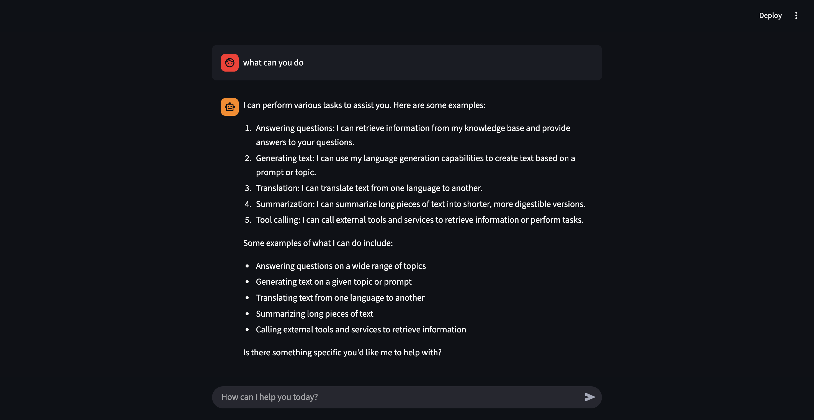

# local-agentic-rag-chatbot
A local chatbot that delivers personalised responses based on user-specific data.



# Prerequisites
Make sure Ollama model and embedding are installed.
- Model: **llama3.2:latest**
- Embedding: **mxbai-embed-large:latest**

# Setup
### 1. Install dependencies
Run the following command to download dependencies from the requirement file:
```bash
pip install -r requirements.txt
```

### 2. Rename `.env`
Rename `.env.example` to `.env`.

### 3. Ingestion
1. Add notes, materials, or personalized information to the`input_data` folder (Make sure to create the folder according to the specified name and the data is in `.txt` format)
2. Run `prepare_db.py`

### 4. Run `chatbot.py`
Since the chatbot runs on the Streamlit framework, run the following command to activate:
```bash
streamlit run chatbot.py
```